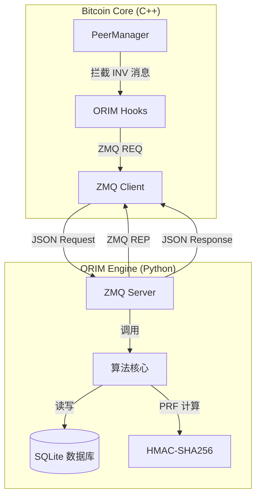

# ORIM项目实现逻辑与架构文档

**区块链隐蔽信道 ORIM 项目 - 第二部分：实现逻辑与架构**

---

## 目录

1. [系统架构概览](#1-系统架构概览)
2. [C++ 核心修改 (Bitcoin Core)](#2-c-核心修改-bitcoin-core)
3. [Python 算法引擎 (ORIM Server)](#3-python-算法引擎-orim-server)
4. [关键算法流程](#4-关键算法流程)

---

## 1. 系统架构概览

本项目采用 **C++ 与 Python 混合架构**，通过 ZeroMQ (ZMQ) 实现高性能进程间通信 (IPC)。

### 1.1 架构图



### 1.2 通信机制

- **协议**: ZeroMQ (ZMQ)
- **模式**: Request-Reply (`ZMQ_REQ` / `ZMQ_REP`)
- **数据格式**: JSON
- **默认端点**: `tcp://127.0.0.1:5555`
- **角色**:
  - **Client (C++)**: Bitcoin Core 节点，发起重排序请求或接收通知。
  - **Server (Python)**: 算法引擎，处理加密、排序和数据库操作。

---

## 2. C++ 核心修改 (Bitcoin Core)

主要修改集中在 `src/net_processing.cpp` 文件中的 `PeerManagerImpl` 类。

### 2.1 初始化与资源管理

在 `PeerManagerImpl` 的构造函数和析构函数中管理 ZMQ 连接：

- **初始化 (`InitORIM`)**:
  - 读取 `-enableorim` 参数决定是否启用。
  - 创建 ZMQ Context 和 `ZMQ_REQ` 套接字。
  - 设置发送/接收超时 (`ZMQ_RCVTIMEO`, `ZMQ_SNDTIMEO`) 为 100ms，防止阻塞 Bitcoin 主线程。
  - 连接到 Python 服务器。

- **销毁 (`ShutdownORIM`)**:
  - 安全关闭 ZMQ 套接字和上下文，释放资源。

### 2.2 发送端钩子 (Sender Hooks)

**位置**: `PeerManagerImpl::SendMessages`

在发送 `INV` (Inventory) 消息给对等节点之前，调用 `ORIMReorderInv` 函数：

```cpp
// 伪代码示例
if (!vInv.empty()) {
    // ORIM 拦截：在发送前重排序哈希
    ORIMReorderInv(pto->GetId(), "tx", vInv);
    
    // 发送重排序后的 vInv
    m_connman.PushMessage(pto, msgMaker.Make(NetMsgType::INV, vInv));
}
```

**`ORIMReorderInv` 逻辑**:
1. **线程安全锁**: 使用 `std::lock_guard<std::mutex> lock(m_orim_mutex)` 保护非线程安全的 ZMQ 套接字。
2. **构建请求**: 创建包含 `peer_id`, `inv_type`, 和哈希列表的 JSON 对象。
3. **IPC 通信**: 发送请求给 Python 服务器，等待重排序后的哈希列表。
4. **应用重排**: 解析响应，根据返回的哈希顺序重新排列 `vInv` 向量。
5. **异常处理**: 如果通信超时或出错，回退使用原始顺序，确保 Bitcoin 功能不受影响。

### 2.3 接收端钩子 (Receiver Hooks)

**位置**: `PeerManagerImpl::ProcessMessage` (处理 `NetMsgType::INV` 时)

在处理接收到的 `INV` 消息时，调用 `ORIMProcessReceivedInv`：

```cpp
if (msg_type == NetMsgType::INV) {
    vRecv >> vInv;
    // ... 标准处理 ...
    
    // ORIM 拦截：通知 Python 提取隐蔽信息
    ORIMProcessReceivedInv(pfrom.GetId(), inv_type, vInv);
}
```

**`ORIMProcessReceivedInv` 逻辑**:
1. **线程安全锁**: 同样使用 `m_orim_mutex` 加锁。
2. **发送通知**: 将接收到的哈希列表（保持接收顺序）发送给 Python 服务器。
3. **异步处理**: 虽然是 REQ-REP 模式，但 C++ 端仅等待简单的 ACK，实际解码逻辑在 Python 端完成。

### 2.4 线程安全设计

Bitcoin Core 是多线程环境，多个线程可能同时调用 `SendMessages` 或 `ProcessMessage`。

- **问题**: ZMQ 套接字不是线程安全的。
- **解决方案**: 引入 `std::mutex m_orim_mutex`。
- **实现**: 在所有涉及 ZMQ 操作的函数中使用 `std::lock_guard` 进行 RAII 风格的加锁，确保同一时刻只有一个线程能访问 ZMQ 套接字。

---

## 3. Python 算法引擎 (ORIM Server)

`orim_server.py` 实现了核心的隐蔽信道算法。

### 3.1 发送端流程 (`handle_send_request`)

该函数实现了 **Algorithm 2 (Data Encoding)**：

1. **PRF 计算**: 对输入的每个交易哈希 $h_i$，计算伪随机函数值 $v_i = \text{HMAC-SHA256}(k, h_i)$。
2. **建立规范序 (Canonical Order)**:
   - 将哈希按其 PRF 值 $v_i$ 从小到大排序。
   - 这个排序是发送方和接收方都能独立计算出的“基准顺序”。
3. **获取秘密数据**: 从 SQLite 数据库 (`outgoing_messages` 表) 读取待发送的比特流。
4. **完全二叉树编码 (Complete Binary Tree)**:
   - 根据哈希数量 $n$，计算最大容量 $m$ (满足 $2^{m-1} < n! \le 2^m$)。
   - 将秘密比特转换为目标排列的秩 (Rank)。
5. **生成排列**:
   - Rank $\to$ Lehmer Code (阶乘进制数)。
   - Lehmer Code $\to$ Permutation (排列向量)。
6. **重排序**: 将“规范序”下的哈希列表应用生成的排列，得到最终发送顺序。

### 3.2 接收端流程 (`handle_receive_request`)

该函数实现了 **Algorithm 4 (Data Decoding)**：

1. **PRF 计算**: 对接收到的哈希列表 $H'$ 计算 PRF 值。
2. **重建规范序 (关键步骤)**:
   - 接收方虽然收到的是乱序的哈希，但通过对 PRF 值排序，可以还原出与发送方完全一致的“规范序”。
   - **逻辑**: `sorted_hashes = sorted(received_hashes, key=lambda h: prf(h))`。
3. **计算逆排列**:
   - 确定接收到的每个哈希在“规范序”中的位置。
   - 生成逆排列向量 $\pi^{-1}$。
4. **解码**:
   - Permutation $\to$ Lehmer Code $\to$ Rank。
   - 使用完全二叉树算法将 Rank 还原为秘密比特。
5. **存储**: 将提取的比特存入 `incoming_messages` 表，并尝试组装为完整消息。

---

## 4. 关键算法流程

### 4.1 变长编码 (Variable-Length Encoding)

为了最大化信道容量，我们实现了基于完全二叉树的变长编码：

- **阈值计算**: $T = 2^m - n!$
- **编码逻辑**:
  - 如果 Rank $< T$，编码 $m$ 位数据。
  - 如果 Rank $\ge T$，编码 $m-1$ 位数据。
- **优势**: 相比固定长度编码 ($\lfloor \log_2 n! \rfloor$)，该算法能充分利用 $n!$ 空间，平均容量接近理论极限 $\log_2 n!$。

### 4.2 规范排序 (Canonical Sorting)

这是 ORIM 方案的核心创新点，解决了接收方如何在不知道原始顺序的情况下恢复信息的问题。

- **发送方**: 原始哈希 $\to$ 规范序 $\xrightarrow{\text{秘密信息}}$ 发送序
- **接收方**: 接收序 $\xrightarrow{\text{排序}}$ 规范序 $\xrightarrow{\text{对比}}$ 提取秘密信息

通过共享密钥 $k$ 和确定性的排序规则，双方建立了一个共享的参考系。

---

**文档版本**: v1.0  
**最后更新**: 2024年12月11日  
**适用项目**: ORIM Covert Channel Implementation
